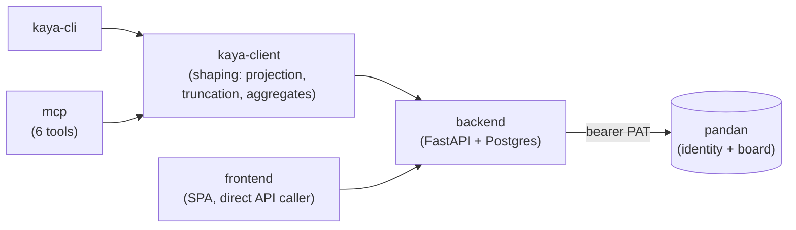

# kaya

A cloud-hosted, Obsidian-like **markdown notes** app, API-first and agent-drivable. It is the docs
half of the `kayatoast` suite, sibling to [pandan](https://github.com/leejianrong/pandan), the kanban
board. Where pandan tracks *work*, kaya holds the *knowledge*: specs, notes, runbooks, meeting notes,
cross-linked to the board.

> **Status: the MVP is done, and kaya has moved past it.** A pandan PAT creates, reads, edits and
> deletes notes over `/api/v1/notes`, and the whole stack ships as one container image serving the
> SPA and the API from a single origin. **`kaya` drives all of it from a shell** —
> `note {list,get,create,edit,move,delete}`, `links <ref>`, `backlinks <ref>` and
> `config {set,show,path}`, in `human`, `json` or `toon`. The SPA is a browsable app: a CodeMirror 6
> editor, a folder tree, a live preview with `[[wikilink]]` pills and autocomplete, a PAT paste to get
> in, a conflict banner when two writers collide, a graph view over `note_link`, and a live pandan
> board embedded read-only in a note. Full-text search runs end to end: a ranked `?q=` in the API,
> `--q` on `note list`, a box in the sidebar. The MCP server registers six tools and all six work.
> Building now, beyond the MVP: export/import, per-note version history, and attachments (see
> [`docs/roadmap/BREADBOARD.md`](docs/roadmap/BREADBOARD.md)) — an org/team model is investigated but
> not designed, and an independent hosted deploy is scoped but **deliberately parked**, not scheduled.
> What has no answer at all is still **where to point any of it: there is no hosted deployment** (see
> *Where to point it*, below).
> See [`docs/PLAN.md`](docs/PLAN.md) for what the MVP built,
> [`docs/roadmap/BREADBOARD.md`](docs/roadmap/BREADBOARD.md) for what's beyond it,
> [`docs/SLICES.md`](docs/SLICES.md) for the MVP's build order, and [`CLAUDE.md`](CLAUDE.md) for what
> is genuinely in each package today. Work is tracked on pandan board 18, `kaya — Notes`.



Two adapters (`kaya-cli`, `mcp`) share one client so payload shaping lives in exactly one place; the
SPA talks to the backend directly, by design (ADR 0004). The arrow only ever points one way.

## Install the CLI

The [latest release](https://github.com/leejianrong/kaya/releases/latest) carries one asset,
`kaya-linux-x86_64`: a single self-contained executable, **Linux x86_64, glibc 2.28 or newer** —
Ubuntu 20.04+, Debian 11+, RHEL/Rocky/Alma 8+, Amazon Linux 2023. There is no macOS or Windows
build — a onefile artifact is per-platform, and the pipeline ships only what one build can prove.

```bash
mkdir -p ~/.local/bin
curl -fsSL -o ~/.local/bin/kaya \
  https://github.com/leejianrong/kaya/releases/latest/download/kaya-linux-x86_64
chmod +x ~/.local/bin/kaya
```

The asset is named for the downloads folder it lands in; the command is `kaya`. Check what you
actually got:

```console
$ kaya --version
kaya 0.12.0 (8f0d0ff)
```

The sha is the commit it was built from, and a build that did *not* come from the release pipeline
says `source checkout, not a released build` instead of staying quiet — that is the whole of
[ADR 0007](docs/adr/0007-release-provenance-from-the-first-release.md), and the line is worth
pasting into any bug report. Want a shorter name? `ln -sf ~/.local/bin/kaya ~/.local/bin/ky`; there
is deliberately no second console script.

**`v0.12.0` is the current release and it is the full tool** — bare `kaya`, every `note` verb,
`links`/`backlinks`, `config`, `--q`, `--fields`, `--full` are all there; check with `kaya --help`.
`main` has moved a handful of commits past that tag since, one of them behavioural to the CLI surface
(KAN-839: a malformed `--if-updated-at` now exits `2`, not `1`), tracked by `kaya-cli`'s own version
bump to `0.13.0` — a rebuild off `main` picks that up; the released binary hasn't caught up yet.

### Where to point it

**There is no hosted kaya, so the binary has no origin until you start one yourself.** This is
[ADR 0010](docs/adr/0010-no-hosted-deploy-until-the-homelab.md) on purpose, not an omission: the
image and the Kubernetes manifests are built and exercised locally, and the k8s homelab is kaya's
first real deploy. See that ADR's §Amendment (2026-08-20) for the decision and for the three things a
remote origin would still prove that a local one cannot. The limit that leaves is a real one and
worth naming: **running kaya means a repository checkout and a working Docker, so no checkout or no
Docker means no kaya**, whatever the download suggests.

```bash
make up                                     # db + migrate + the app image, one origin on :8000
```

If ports `5432` or `8000` are already taken on your machine, pass your own —
`KAYA_DB_PORT=5434 KAYA_APP_PORT=8010 make up` — and remember that `KAYA_API_URL` below has to
name the port you chose, not `8000`.

Then give the CLI an origin and a credential:

```bash
export KAYA_API_URL=http://localhost:8000   # the default, and what `make up` serves
export KAYA_TOKEN=…                         # a pandan PAT — kaya mints none of its own (ADR 0002)
kaya                                        # your five most recent notes, and what to do next
kaya note list --fields ref,title,path
kaya note create "A title" --body-file notes/draft.md
kaya note get NOTE-12 --format json
```

`kaya config set --api-url …` writes those to a config file instead, and `kaya config show`
reports what resolved and from which tier — it never prints the token, only whether there is one.
[`kaya-cli/README.md`](kaya-cli/README.md) has the formats, the error contract and the exit codes.

## What it does

Write markdown in a real editor, organise notes in folders, search the full text, and link notes to
each other with `[[wikilinks]]`. A wikilink can also point at board work: `[[KAN-12]]` renders the
card's title and column inline, and a backlinks panel answers "which notes mention this card".

The same PAT that drives the board drives the notes, from the same config, with no second login and
no second token. An agent working `KAN-12` reads its spec note, edits it, and moves the card, using
one credential throughout — from the CLI, from the browser, or from an MCP host.

## The plan

| Document | What it holds |
|---|---|
| [`docs/PLAN.md`](docs/PLAN.md) | Problem, solution, scope, requirements, the shape, affordances, testing approach, open risks, and (§Beyond the MVP) what's building now |
| [`docs/SLICES.md`](docs/SLICES.md) | The MVP's seven vertical slices, each with a build plan and acceptance criteria — closed and frozen |
| [`docs/roadmap/BREADBOARD.md`](docs/roadmap/BREADBOARD.md) | The shape of every epic since the MVP: what shipped, what's building, what's a spike |
| [`docs/QUESTIONS.md`](docs/QUESTIONS.md) | The decision register: what was decided, what is a default, what is deferred |
| [`docs/adr/`](docs/adr/) | Ten architectural decisions, with what was rejected and why |
| [`docs/kaya-vision.md`](docs/kaya-vision.md) | The founding statement of intent, kept verbatim |

Start with `PLAN.md`. The ADRs worth reading first are
[0002 (identity)](docs/adr/0002-identity-pandan-as-provider.md) and
[0004 (why payload shaping lives in the shared client)](docs/adr/0004-shaping-lives-in-the-shared-client.md).
Between them they carry most of what makes this project different from a generic notes app.

## Development

Needs `uv` (Python 3.12), Node 24.15+ and Docker. This is a single-maintainer project with no
separate contributor process — the conventions below are the whole of it.

```bash
make hooks         # install the pre-push gate (do this once)
make install       # uv sync every Python package, npm ci the SPA
make dev           # Postgres, backend on :8000, SPA on :5173
make up            # the whole stack from the container image, one origin on :8000
make k3d           # deploy/k8s on a local k3d cluster, then prove the pod serves
make test          # the fast, no-infra layer
make check         # everything pre-push runs
make help          # every target, including the one still stubbed
```

`make up` is the only origin there is; *Where to point it* above says why and what it costs, and
[ADR 0010](docs/adr/0010-no-hosted-deploy-until-the-homelab.md) is the decision behind it.

Five packages in one repo (`backend/`, `frontend/`, `kaya-client/`, `kaya-cli/`, `mcp/`) with the
dependency arrow pointing one way: adapters depend on the client, and nothing depends on an adapter
([ADR 0001](docs/adr/0001-stack-inherited-from-pandan.md)).

Conventions, commands and the traps worth knowing live in [`CLAUDE.md`](CLAUDE.md), which is written
for coding agents and is equally the fastest orientation for a person.

## Licence

Apache License 2.0. The full text is in [`LICENSE`](LICENSE).
