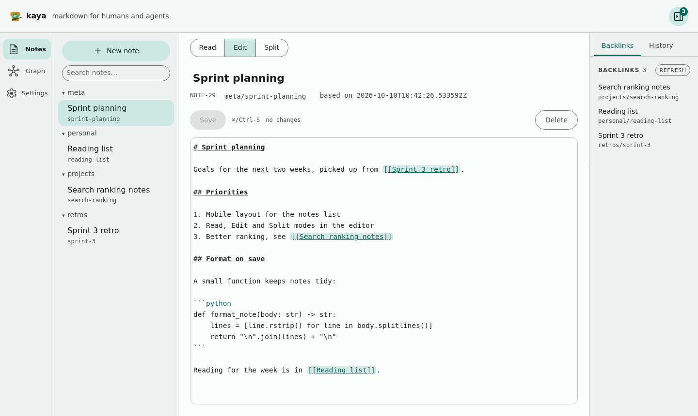
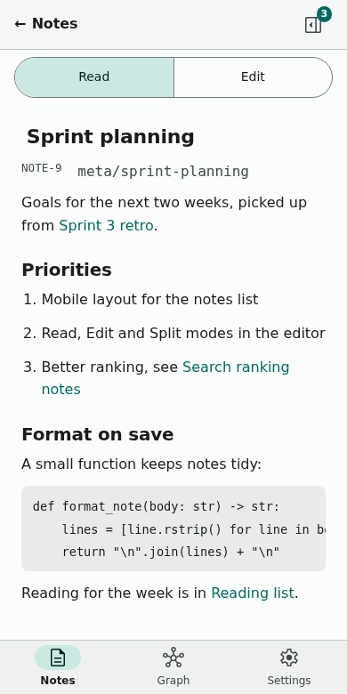
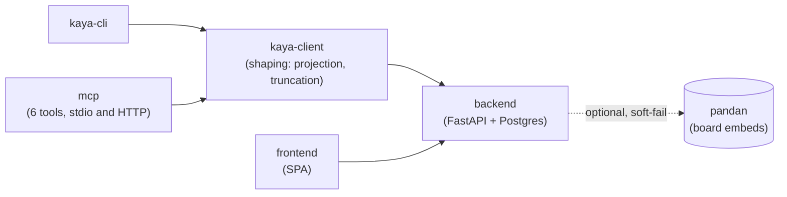

<p align="center">
  <picture>
    <source media="(prefers-color-scheme: dark)" srcset="docs/images/logo-dark.svg">
    
  </picture>
</p>

# kaya

Markdown notes that you and your agents work on together. Use kaya in the browser, point Claude Code or any MCP client at the hosted endpoint, or script it with the CLI. Notes link to each other with `[[wikilinks]]`, and a knowledge graph shows how they connect.

The web app has Read, Edit and Split modes and also works on a phone, and everything it does goes through one REST API. A note can embed a live board from [pandan](https://github.com/leejianrong/pandan), the kanban sibling in the same suite.





## What you get

- **An editor that fits the screen.** Read, Edit or Split on a desktop, a bottom navigation bar and
  a list-then-note flow under 600px.
- **Links that go both ways.** Wikilinks with autocomplete, a backlinks panel, and a graph view of
  how notes connect.
- **History and search.** Per-note version history, and ranked full-text search from the sidebar,
  the CLI and the API.
- **Agent-friendly output.** The CLI and the MCP server share one client that projects fields and
  truncates long bodies, so an agent reads a note without paying for all of it.
- **Its own accounts.** Sign in with GitHub in the browser, and mint personal access tokens or use
  a device-flow login for the CLI. kaya does not call pandan to authenticate anyone.
- **Export and import.** `kaya export-all` writes an Obsidian-compatible directory, and
  `kaya import-all` reads one.

## Quick start

kaya runs hosted at <https://kaya-jian.fly.dev>. Sign in there with GitHub and you have a notes app.
To use it from a shell, install the CLI and log in:

```bash
mkdir -p ~/.local/bin
curl -fsSL -o ~/.local/bin/kaya \
  https://github.com/leejianrong/kaya/releases/latest/download/kaya-linux-x86_64
chmod +x ~/.local/bin/kaya

kaya config set --api-url https://kaya-jian.fly.dev
kaya auth login        # prints a link and a code, you approve it in the browser
kaya                   # your five most recent notes
```

The release binary is Linux x86_64 only (glibc 2.28 or newer). On anything else, use
`uv tool install "git+https://github.com/leejianrong/kaya.git#subdirectory=kaya-cli"`. Run
`kaya --version` to see which release and commit you have; the binary can trail `main`, so check
[the releases page](https://github.com/leejianrong/kaya/releases) for what a given number includes.

## Usage

From a shell:

```bash
kaya note create "Sprint planning" --path meta/sprint-planning --body-file plan.md
kaya note list --q "ranking" --fields ref,title,path
kaya note get NOTE-12
kaya backlinks NOTE-12
```

`--format json` or `--format toon` change the output shape, and `--full` lifts the body truncation.
The CLI guide in [`kaya-cli/README.md`](kaya-cli/README.md) covers formats, error codes and exit
codes.

From an agent, kaya serves MCP over Streamable HTTP at `/mcp`, with OAuth discovery, so a client
that supports remote MCP only needs the URL. With Claude Code:

```bash
claude mcp add --transport http kaya https://kaya-jian.fly.dev/mcp
```

The server registers six tools: list, get, create and edit a note, search, and read backlinks. A
local stdio server is also available, and the direction it follows (every MCP tool has a CLI verb
behind it) is stated once in [`mcp/README.md`](mcp/README.md).

`kaya context install` adds a Claude Code SessionStart hook, so an agent session opens already
knowing your most recent notes.

## Run your own

You need Docker, and a checkout of this repository:

```bash
make up      # Postgres, migrations and the app image, one origin on http://localhost:8000
make down
```

That serves the app and API, and `KAYA_API_URL=http://localhost:8000` is the CLI's default. Signing
in needs a GitHub OAuth app, whose credentials the server reads from `KAYA_GITHUB_OAUTH_CLIENT_ID`
and `KAYA_GITHUB_OAUTH_CLIENT_SECRET` (see [ADR 0012](docs/adr/0012-standalone-identity.md)).
`make up` forwards only `DATABASE_URL` and `KAYA_PANDAN_URL` to the container, so for a login you
will need to run the backend directly, as [`CLAUDE.md`](CLAUDE.md) describes. If ports `5432` or
`8000` are taken, set `KAYA_DB_PORT` and `KAYA_APP_PORT`. Deployment notes for Fly.io are in
[`docs/deploy/fly.md`](docs/deploy/fly.md).

## How it fits together


```mermaid
flowchart LR
    CLI["kaya-cli"] --> Client["kaya-client\n(shaping: projection, truncation)"]
    MCP["mcp\n(6 tools, stdio and HTTP)"] --> Client
    SPA["frontend\n(SPA)"]
    Client --> Backend["backend\n(FastAPI + Postgres)"]
    SPA --> Backend
    Backend -.->|"optional, soft-fail"| Pandan[("pandan\n(board embeds)")]
```

The CLI and MCP server are thin adapters over one shared client, so payload shaping lives in one
place ([ADR 0004](docs/adr/0004-shaping-lives-in-the-shared-client.md)). The browser app talks to
the backend directly. Pandan is optional: notes save, render and search with it down
([ADR 0003](docs/adr/0003-cross-linking-one-way-soft.md)).

## Documentation

[`docs/PLAN.md`](docs/PLAN.md) is the place to start. [`docs/roadmap/BREADBOARD.md`](docs/roadmap/BREADBOARD.md)
covers what was built after the MVP, [`docs/adr/`](docs/adr/) holds the decisions and what was
rejected, and [`docs/kaya-vision.md`](docs/kaya-vision.md) is the founding intent. Work is tracked on
pandan board 18, "kaya - Notes".

## Development

Needs `uv` (Python 3.12), Node 24.15+ and Docker.

```bash
make hooks     # install the pre-push gate, once per clone
make install   # uv sync every Python package, npm ci the SPA
make dev       # Postgres, backend on :8000, SPA on :5173
make check     # everything pre-push runs
make help      # every target
```

This is a single-maintainer project. Conventions, commands and traps are in
[`CLAUDE.md`](CLAUDE.md), which is written for coding agents and is the fastest orientation for a
person too.

## License

Apache License 2.0. The full text is in [`LICENSE`](LICENSE).
