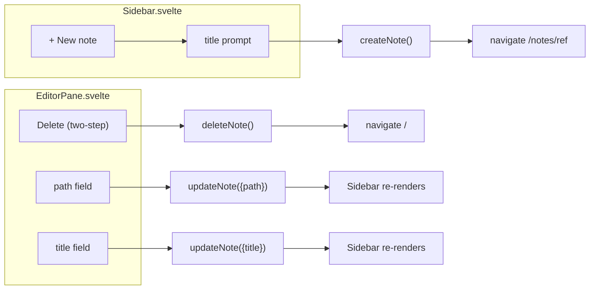
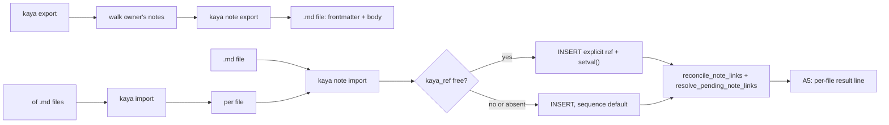
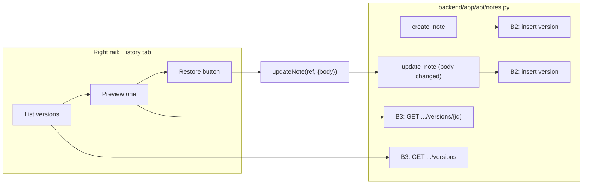
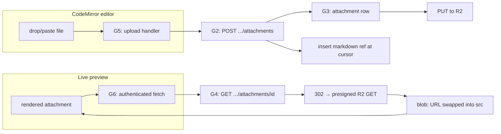

**Provenance.** This is the original detail doc for the 2026-09-01 shaping session (`FRAME.md`,
`SHAPING.md`), recovered 2026-09-02 from an uncommitted working tree rather than lost as first assumed.
The top-level `docs/roadmap/BREADBOARD.md` is a **separate, later document** — it covers the shipped
post-MVP epics under different R-numbers (R10–R15) and was written specifically because this file
*looked* unrecoverable at the time, reconstructed from board-card comments rather than from this text.
Both R0 (note-authoring parity, KAN-1040–1043) and R5.1–R5.3 below (export/import, version history,
attachments — KAN-1051/1052/1053, built out as KAN-1060–1069) have since shipped; this file is kept for
the fuller technical detail (e.g. the `G6` blob-URL fit check under Detail R5.3) that the reconstruction
couldn't recover verbatim, not as an active spec.

# Detail R0: note-authoring parity — breadboard

R0 has a **single shape of record**, not a bake-off: the backend and `kaya-client` already fully
support create/delete/move/retitle (they've supported all four since V2b), so there's no mechanism to
discover — only UI affordances to wire onto calls that already exist. No flags (⚠️) anywhere below.

## A: Wire existing `kaya-client` calls into new SPA affordances

| Part | Mechanism |
|------|-----------|
| **A1** | **Create** — a "+ New note" control in `Sidebar.svelte`'s header opens a minimal inline title prompt; on submit, calls the already-exported `createNote()` (`lib/notes.ts:53`) and navigates to the new note's ref |
| **A2** | **Delete** — a "Delete" control in `EditorPane.svelte`'s header, two-step (click arms it, a second click within the same render confirms — no browser-native `confirm()`, no modal library), calls the already-exported `deleteNote()` (`lib/notes.ts:132`), navigates home after |
| **A3** | **Move/rename path** — an editable path field in `EditorPane.svelte` under the title, saved on blur via the already-exported `updateNote(ref, { path })` (`moveNote` is sugar over this, per ADR 0008) |
| **A4** | **Edit title** — replace the static `<h2>{note.title}</h2>` (`EditorPane.svelte:656`) with an editable input, saved on blur/Enter via `updateNote(ref, { title })` |

None of A2–A4 touch ADR 0009's precondition — title/path-only writes are unguarded by design (the
guard is body-only), so none of these need `if_updated_at`.

## UI Affordances

| ID | Place | Affordance | Wires Out |
|----|-------|------------|-----------|
| A1-UI | `Sidebar.svelte` header | `+ New note` button | → A1-NonUI |
| A1-UI2 | `Sidebar.svelte` header (on click) | Inline title input + Create/Cancel | → A1-NonUI on Create |
| A2-UI | `EditorPane.svelte` header | `Delete` button, arms on first click, confirms on second | → A2-NonUI on confirm |
| A3-UI | `EditorPane.svelte`, under the title | Editable path field, placeholder "(no folder)" | → A3-NonUI on blur, only if changed |
| A4-UI | `EditorPane.svelte` title area | Editable title input (replaces the static `<h2>`) | → A4-NonUI on blur/Enter, only if changed |

## Non-UI Affordances

| ID | Place | Affordance | Wires Out |
|----|-------|------------|-----------|
| A1-NonUI | `lib/notes.ts` | `createNote()` → `POST /api/v1/notes` (already exists) | → `router` navigates to `/notes/<new-ref>` |
| A2-NonUI | `lib/notes.ts` | `deleteNote()` → `DELETE /api/v1/notes/{ref}` (already exists) | → `router` navigates to `/` |
| A3-NonUI | `lib/notes.ts` | `updateNote(ref, { path })` (already exists, `moveNote` delegates to it) | → Sidebar's note list re-renders (existing subscription, no new wiring) |
| A4-NonUI | `lib/notes.ts` | `updateNote(ref, { title })` (already exists) | → Sidebar row label re-renders (same subscription) |

## Wiring

## Slices

Each is independently demoable and touches a different part of the UI, so they ship as four separate
stories under one epic rather than one large card:

| Slice | Demo |
|-------|------|
| S1 — Create | Click "+ New note", type a title, land in the editor on a fresh empty note |
| S2 — Delete | Open a note, click Delete twice, land back on the home view, note is gone from the sidebar |
| S3 — Retitle | Open a note, edit the title field, blur, sidebar label updates, reload confirms it persisted |
| S4 — Move | Open a note, edit the path field, blur, sidebar tree re-groups it into the new folder, reload confirms it persisted |

---

# Detail R2/R3: enterprise direction — not yet breadboarded

R2 (org/team model) and R3 (self-hosting readiness) are **intentionally not detailed here**. Both are
flagged (⚠️) at the mechanism level — kaya cannot say *how* an org/team scopes a note until pandan's
identity layer decides *what* an org/team is (pandan#322), and cannot say what self-hosting docs need
until pandan#323's audit lands. Turning either into a fit check today would produce a shape full of
flags, which the shaping method treats as a shape that hasn't earned a ✅ anywhere yet.

What's tracked on board 18 for these two is one placeholder epic and one kaya-side spike — see
`SHAPING.md`'s "Decisions made" section. The spike's job is exactly what the shaping method asks of a
spike: learn what kaya-side changes an org/team model would require (which tables gain a scope column,
whether `authorize_note`'s owner check becomes a team check, whether the SPA's credential model
changes), not to decide whether to build it.

---

# Detail R5.1: export/import — breadboard

Single shape of record (Shape A) — ADR 0008 already commits the general architecture (ref survives in
frontmatter, reused when free), and the shaping session found kaya's note bodies are already
Obsidian-native (see `SHAPING.md`'s 2026-09-01 session notes), so there's no link-rewriting mechanism
to bake off between alternatives. No flags (⚠️) below — every part reuses an existing function or a
concretely-specified new one.

## Requirements (R5.1)

| ID | Requirement | Status |
|----|-------------|--------|
| R5.1.1 | Single-note export/import via CLI: frontmatter (`kaya_ref`, `title`, `path`, `created_at`, `updated_at`) + body verbatim | Core goal |
| R5.1.2 | Corpus (whole-vault) export/import via CLI, Obsidian-vault-compatible directory layout (`path` → directories, `title` → filename) | Core goal |
| R5.1.3 | Arbitrary non-kaya markdown folders are a first-class bulk-import source (no kaya frontmatter required) | Core goal |
| R5.1.4 | Body content needs no link rewriting on export — `[[Title]]` is already Obsidian-native syntax | Guardrail (finding, not a build task) |
| R5.1.5 | Import triggers the same `reconcile_note_links`/`resolve_pending_note_links` calls a normal save makes — no separate resolution path | Must-have |
| R5.1.6 | `NOTE-n` ref is preserved on import if globally free (checked across the whole `note` table, not just the importing owner's notes), else a fresh ref is minted | Must-have |
| R5.1.7 | CLI-only surface — no MCP or SPA export/import in this card | Decided scope |

## A: Frontmatter + Obsidian-shaped body, existing note_link reconciliation reused

| Part | Mechanism | Flag |
|------|-----------|:---:|
| **A1** | **Single-note export** — `kaya note export <ref>` writes one `.md` file: a small frontmatter block + the body verbatim (no rewriting — R5.1.4) | |
| **A2** | **Single-note import** — `kaya note import <file>` parses frontmatter; if `kaya_ref` is present and globally free, an explicit `INSERT ... (ref, ...) VALUES ('NOTE-42', ...)` bypassing the sequence default, followed by `SELECT setval('note_ref_seq', 42)` if 42 exceeds the sequence's current value (prevents a later organic `nextval()` from colliding); otherwise a normal INSERT (sequence-default ref). Then calls `reconcile_note_links` + `resolve_pending_note_links` exactly as `create_note` does today | |
| **A3** | **Corpus export** — `kaya export <dir>` walks the owner's notes, applies A1 per note; directory = `note.path`, filename = sanitized `title` + `.md`; two notes colliding on (path, title) get the ref appended as a disambiguator (`Title (NOTE-42).md`) | |
| **A4** | **Corpus import** — `kaya import <dir>` walks `.md` files; a file with `kaya_ref` frontmatter uses A2; a file with none (a genuine external vault file — R5.1.3) always mints fresh, deriving `path` from the file's directory relative to the import root and `title` from frontmatter `title:` if present, else the filename stem | |
| **A5** | **Import summary** — CLI prints one line per file: `created @ NOTE-n` / `restored @ NOTE-n` / `remapped: NOTE-x requested, NOTE-y assigned (NOTE-x already exists)` / `skipped: <reason>`, matching ADR 0005's structured-output convention rather than a silent bulk write | |

## Fit Check (R5.1 × A)

| Req | Requirement | Status | A |
|-----|-------------|--------|---|
| R5.1.1 | Single-note export/import via CLI with frontmatter + verbatim body | Core goal | ✅ |
| R5.1.2 | Corpus export/import, Obsidian-vault-compatible layout | Core goal | ✅ |
| R5.1.3 | Arbitrary non-kaya markdown folders importable | Core goal | ✅ |
| R5.1.4 | No link rewriting needed on export | Guardrail | ✅ |
| R5.1.5 | Import reuses existing note_link reconciliation | Must-have | ✅ |
| R5.1.6 | Ref preserved-if-globally-free else minted fresh | Must-have | ✅ |
| R5.1.7 | CLI-only surface | Decided scope | ✅ |

## Non-UI Affordances

| ID | Place | Affordance | Wires Out |
|----|-------|------------|-----------|
| A1-NonUI | `kaya_cli/verbs.py` + `kaya_client` | `export_note(ref)` → renders frontmatter + body to a file | → A1 |
| A2-NonUI | `kaya_client` → `backend/app/api/notes.py` | New `import_note(file)` path: sequence-bypass INSERT or normal INSERT, then `reconcile_note_links`/`resolve_pending_note_links` (both already exist, `note_links.py`) | → A2 |
| A3-NonUI | `kaya_cli/verbs.py` | Directory walk + A1 per note, collision suffixing | → A3 |
| A4-NonUI | `kaya_cli/verbs.py` | Directory walk + A2/mint-fresh branch, frontmatter-optional parsing | → A4 |
| A5-NonUI | `kaya_cli/failures.py`-style structured output | Per-file result line | → A5 |

## Wiring

## Slices

| Slice | Demo |
|-------|------|
| S1 — Single-note export | `kaya note export NOTE-12`, inspect the file: frontmatter + body, links untouched |
| S2 — Single-note import, ref preserved | Export a note, delete it, `kaya note import` the file, confirm it lands back at the same `NOTE-n` and backlinks still resolve |
| S3 — Corpus export | `kaya export ./vault`, open the directory in Obsidian, confirm `[[Title]]` links render as links there |
| S4 — Corpus import, mixed sources | Import a directory containing both kaya-exported files and a genuine external vault's files, confirm the summary correctly reports created/restored/remapped per file |

---

# Detail R5.2: version history — breadboard

Single shape of record (Shape B). No flags — every part is either a new table following an existing
scoping convention (`note_link`'s no-owner-column pattern) or a reuse of the existing save path.

## Requirements (R5.2)

| ID | Requirement | Status |
|----|-------------|--------|
| R5.2.1 | Every successful body-changing save (create + each update) appends a full-body snapshot | Core goal — decided: every save |
| R5.2.2 | Full-body snapshots, not diffs | Core goal — decided |
| R5.2.3 | No retention/pruning in v1 | Decided — revisit only if storage is a real, measured problem |
| R5.2.4 | `note_version` has no owner column — scoped only via join to `note`, same convention as `note_link` | Must-have (guardrail) |
| R5.2.5 | Restoring a version is an ordinary save (no special-cased write path) — never bypasses ADR 0009's precondition model or note_link reconciliation | Must-have |
| R5.2.6 | `note_version` rows CASCADE-delete with their note — this is content recovery, not note-undelete | Decided scope boundary |
| R5.2.7 | SPA-only surface: a History panel to list/preview/restore; no CLI/MCP verbs in this card | Decided scope |
| R5.2.8 | Stays a separate concern from any future R2/R3 audit trail — no speculative actor/team fields | Decided (guardrail) |

## B: Full-body snapshot table, restore-as-save

| Part | Mechanism | Flag |
|------|-----------|:---:|
| **B1** | **`note_version` table** — `id` PK, `note_id` FK → `note.id` `ON DELETE CASCADE` (R5.2.6), `body Text`, `created_at timestamptz server_default now()`. No `owner_id` (R5.2.4) | |
| **B2** | **Version-cut hook** — `create_note` inserts version #1 with the initial body; `update_note`'s existing `if "body" in changes:` branch (`backend/app/api/notes.py:190`, right next to the existing `reconcile_note_links` call) also inserts a new `note_version` row with the post-write body | |
| **B3** | **List/read endpoints** — `GET /api/v1/notes/{ref}/versions` (newest first) and `GET /api/v1/notes/{ref}/versions/{id}`, both resolving `ref` through `refs.py` then scoping via a join to `note.owner_id`, same pattern as backlinks | |
| **B4** | **Restore** — no new write endpoint. The SPA calls the *existing* `updateNote(ref, { body: version.body })`, which naturally cuts a fresh version via B2 and re-triggers reconciliation (R5.2.5) | |
| **B5** | **SPA integration** (`lib/notes.ts`, direct backend calls — no `kaya-client` involved, matching R0's precedent that the SPA never routes through the shared client) — `listNoteVersions(ref)`, `getNoteVersion(ref, id)`; a "History" tab in the right rail beside Backlinks (`Sidebar`/right-rail area established by KAN-568) | |

## Fit Check (R5.2 × B)

| Req | Requirement | Status | B |
|-----|-------------|--------|---|
| R5.2.1 | Version cut on every save | Core goal | ✅ |
| R5.2.2 | Full-body snapshots | Core goal | ✅ |
| R5.2.3 | No pruning in v1 | Decided | ✅ |
| R5.2.4 | No owner column, scoped via join | Must-have | ✅ |
| R5.2.5 | Restore is an ordinary save | Must-have | ✅ |
| R5.2.6 | CASCADE-delete with the note | Decided | ✅ |
| R5.2.7 | SPA-only surface | Decided | ✅ |
| R5.2.8 | Separate from any future audit trail | Decided | ✅ |

## UI Affordances

| ID | Place | Affordance | Wires Out |
|----|-------|------------|-----------|
| B-UI1 | Right rail, next to Backlinks | "History" tab: list of versions by timestamp | → B3 |
| B-UI2 | History tab, per row | Click a version → read-only preview | → B3 (get one) |
| B-UI3 | Preview view | "Restore this version" button | → B4 |

## Non-UI Affordances

| ID | Place | Affordance | Wires Out |
|----|-------|------------|-----------|
| B3-NonUI | `backend/app/api/notes.py` (new routes) | `GET .../versions`, `GET .../versions/{id}` | → right rail list/preview |
| B2-NonUI | `backend/app/api/notes.py` (existing `create_note`/`update_note`) | Insert `note_version` row alongside the existing body write | → B3's list |
| B4-NonUI | `lib/notes.ts` (existing `updateNote`) | `updateNote(ref, { body })` — no new client method | → re-cuts a version via B2 |

## Wiring

## Slices

| Slice | Demo |
|-------|------|
| S1 — List versions | Edit a note twice, open the History tab, see two timestamped entries |
| S2 — Preview a version | Click an older entry, see its body rendered read-only without touching the current note |
| S3 — Restore a version | Click Restore on an older entry, confirm the note's current body reverts and a new version now appears reflecting the restore-save |

---

# Detail R5.3: attachments — breadboard

Single shape of record (Shape G) once the storage-provider component is decided below — G3 genuinely
had live alternatives (Q35 was never actually closed), so that one component gets its own fit check
before the overall shape is assembled. One part is flagged (⚠️): see G6.

## Requirements (R5.3)

| ID | Requirement | Status |
|----|-------------|--------|
| R5.3.1 | An attachment can be embedded in a note body and rendered in the live preview | Core goal |
| R5.3.2 | Auth on fetch: attachment bytes never leak to anyone but the note's owner | Must-have (guardrail — Q35, and CLAUDE.md's cross-cutting auth rule) |
| R5.3.3 | Reference lives in markdown as a kaya-proxied URL, never a direct provider URL | Decided |
| R5.3.4 | Primary upload UX: drag-and-drop or paste directly into the CodeMirror editor | Decided |
| R5.3.5 | Storage mechanism must not compete with the note-save connection pool | Must-have (guardrail — same underlying concern as the `/links` release-the-connection rule) |
| R5.3.6 | Storage provider reuses the family's existing planned Cloudflare footprint (KAN-305) where reasonable | Nice-to-have |
| R5.3.7 | No material recurring egress-cost surprise as the hosted origin gets read regularly | Nice-to-have |
| R5.3.8 | Build is sequenced strictly after R1 (KAN-1044–1047) lands — a real origin is needed to configure CORS/callback host against | Decided scope |

## G3: Storage provider — component fit check

Q35 named R2 but never closed the decision, so this component was re-opened and re-fit-checked rather
than carried forward as an assumption.

| Req | Requirement | Status | G3-C: R2 | G3-D: S3 | G3-E: B2 | G3-F: Postgres bytea |
|-----|-------------|--------|:---:|:---:|:---:|:---:|
| R5.3.1 | Embeddable/renderable | Core goal | ✅ | ✅ | ✅ | ✅ |
| R5.3.2 | Auth on fetch, no leak | Must-have | ✅ | ✅ | ✅ | ✅ |
| R5.3.5 | No connection-pool contention | Must-have | ✅ | ✅ | ✅ | ❌ |
| R5.3.6 | Reuses planned Cloudflare footprint | Nice-to-have | ✅ | ❌ | ❌ | ❌ |
| R5.3.7 | No egress-cost surprise | Nice-to-have | ✅ | ❌ | ✅ | ✅ |

**Notes:**
- G3-F fails R5.3.5: attachment bytes stored as Postgres bytea/large objects would flow through the
  same 40-thread pool the note-save path depends on (the same underlying concern CLAUDE.md's `/links`
  rule already codifies for a different route) — eliminated on a Must-have.
- G3-D (S3) fails both Nice-to-haves: a new, unrelated vendor (AWS) alongside the already-planned
  Cloudflare edge work (KAN-305), and metered egress on every proxied read.
- G3-E (B2) fails R5.3.6 (different vendor from the planned Cloudflare footprint) but is otherwise
  competitive — passes R5.3.7 on its own free-egress allowance, independent of any Cloudflare pairing.
- **Decision: G3-C (Cloudflare R2).** Clean sweep, and now backed by an actual fit check rather than
  PLAN.md's original unexamined lean.

## G: kaya-proxied R2 attachments

| Part | Mechanism | Flag |
|------|-----------|:---:|
| **G1** | **R2 bucket + credentials** — one bucket per kaya deployment (not per-user; scoping is app-layer, not bucket-layer); object key `owner_id/note_ref/uuid-filename` (defense-in-depth; the real check is G4, not trust in key structure) | |
| **G2** | **Upload endpoint** — `POST /api/v1/notes/{ref}/attachments`: resolves `ref` via `refs.py`, `authorize_note` ownership check, a short transaction inserts the `attachment` metadata row (G3 below), then streams to R2 with the DB connection already released — same release-before-external-call shape as the `/links` rule | |
| **G3** | **`attachment` table** — `id`, `note_id` FK → `note.id` `ON DELETE CASCADE`, `r2_key`, `content_type`, `size_bytes`, `created_at`. No `owner_id` column — scoped via join to `note`, same convention as `note_link`/`note_version` | |
| **G4** | **Fetch endpoint** — `GET /api/v1/notes/{ref}/attachments/{id}`: resolves `ref`, `authorize_note` check, then a 302 redirect to a short-lived presigned R2 GET URL (cheaper than backend-piped bytes, and the auth check has already happened before the redirect is issued) | |
| **G5** | **Editor upload integration** — a drop/paste handler added to `lib/codemirror.ts` (the sole owner of CM6 internals, per the existing module-graph guard) intercepts a file drop/paste, calls the new upload endpoint, inserts a markdown image reference pointing at `/api/v1/notes/NOTE-42/attachments/<id>` at the cursor on success | |
| **G6** | **Preview rendering — the one real wrinkle** — a plain `` would never carry the SPA's bearer (it lives in `sessionStorage`, attached only to `fetch()` calls per `lib/auth.ts`'s convention — never a cookie). `lib/markdown.ts`'s renderer must special-case attachment URLs: fetch via an authenticated call, then swap in a `blob:` URL for the `` src (with a placeholder while loading) rather than pointing `src` straight at the kaya-proxied endpoint | ⚠️→resolved above |

## Fit Check (R5.3 × G)

| Req | Requirement | Status | G |
|-----|-------------|--------|---|
| R5.3.1 | Embeddable/renderable | Core goal | ✅ |
| R5.3.2 | Auth on fetch, no leak | Must-have | ✅ |
| R5.3.3 | kaya-proxied reference, never a direct provider URL | Decided | ✅ |
| R5.3.4 | Drag/drop or paste upload in the editor | Decided | ✅ |
| R5.3.5 | No connection-pool contention | Must-have | ✅ |
| R5.3.6 | Reuses planned Cloudflare footprint | Nice-to-have | ✅ |
| R5.3.7 | No egress-cost surprise | Nice-to-have | ✅ |
| R5.3.8 | Sequenced after R1 | Decided scope | ✅ |

**Notes:** G6 started flagged (⚠️) during breadboarding — described as "the preview just renders the
image" without a concrete mechanism — and was resolved to the authenticated-fetch-plus-`blob:`-URL
mechanism above before this fit check was run, per the shaping method's rule that a selected shape
carries no unresolved flags.

## UI Affordances

| ID | Place | Affordance | Wires Out |
|----|-------|------------|-----------|
| G-UI1 | CodeMirror editor body | Drop/paste a file | → G5 |
| G-UI2 | Live preview pane | Rendered `` via blob: URL | → G6 |

## Non-UI Affordances

| ID | Place | Affordance | Wires Out |
|----|-------|------------|-----------|
| G2-NonUI | `backend/app/api/notes.py` (new route) | `POST .../attachments` → R2 PUT | → G1/G3 |
| G4-NonUI | `backend/app/api/notes.py` (new route) | `GET .../attachments/{id}` → 302 to presigned R2 GET | → G1 |
| G5-NonUI | `lib/codemirror.ts` | Upload call + markdown insertion | → G2-NonUI |
| G6-NonUI | `lib/markdown.ts` | Authenticated fetch + `blob:` URL swap for attachment images | → G4-NonUI |

## Wiring

## Slices

Sequenced after R1 (KAN-1044–1047) lands, per R5.3.8 — shaped now, built later.

| Slice | Demo |
|-------|------|
| S1 — Upload path | Drop an image into the editor, see the `` markdown reference appear at the cursor |
| S2 — Render path | Switch to preview, see the image actually render via the blob:-URL swap |
| S3 — Auth guardrail proof [mutate] | Attempt to fetch another owner's attachment id directly, confirm 403/404; this is a `[mutate]`-style guard proof per CLAUDE.md's convention — mutate `authorize_note`'s check, confirm the failure names the right thing, restore |
